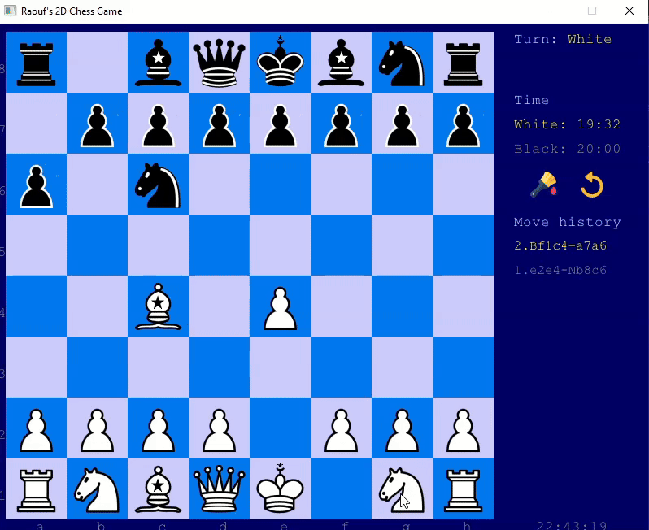

# ChessGame 2D (C++)
ChessGame 2D is a personal C++ project built from scratch to explore game architecture and modern C++ practices.  
It features a custom chess engine with full rule validation, turn and state management, and a clean object-oriented design (No external chess engine used).

# Screenshot


# Features
- Full chess rules (legal moves, captures, turns)
- CPU mode support (play against computer).
- Drag and drop of 2D pieces.
- Capture pieces
- Calculate legal moves for each piece.
- Pawn promotion
- Turn-based system
- Check / Checkmate positions
- Piece-oriented architecture (Piece, Pawn, Queen, King, etc.)
- Custom game logic and validation
- 2D rendering (Raylib)
- Board representation (grid-based)
- Supported game modes: Bullet, Blitz, and Rapid.
- Settings can be selected before starting the game.
- Save a detailled move history of last games.
- Theme selection during and before the game.
- Stalemate (draw) detection.
- King/Queen side Castle supported.


# Project Goals
- Problem solving, (project built from scratch).
- Practice modern C++ (OOP, polymorphism, smart pointers, inheritance, interfaces, STL containers)
- Clean architecture & separation of concerns
- Build a clean and extensible chess engine
- Separate game logic from rendering and input handling
- Memory management

# Technologies
- C++ 17
- Raylib (2D rendering & input)
- STL (`std::vector`, `std::unique_ptr`, etc.)


# Architecture Highlights
- Piece selection
- Move validation independent from rendering
- Centralized game state management
- Polymorphic piece system
- No external chess engine used
- Time/States & Complex chess rules management.
- Separation between game logic and rendering.


# Future Work
- AI opponent
- Networked multiplayer
- Better animations / effects


# Setup
## Prerequisites
- C++17 compatible compiler (g++, MSVC, etc.)
- [Raylib](https://www.raylib.com/) library installed.
- Git to clone the project.


## Clone the projet
```bash
git clone https://github.com/bAbderraouf/ChessGame.git

<!-- TODO: Installation Guide , Exemple d’utilisation , Licence (MIT, Apache, etc.) -->
