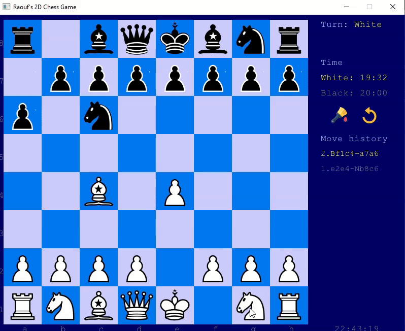

# ♟️ ChessGame 2D — C++17 / Raylib

ChessGame 2D is a personal C++ project built from scratch to explore game architecture and modern C++ practices.

It features a custom chess engine with legal move validation, turn and game-state management, and a clean object-oriented design.

> **No external chess engine is used. Chess rules and move validation are implemented within the project.**

▶️ Watch the full gameplay demo:  [🎥 Demo](https://youtu.be/dXdZihGMoDY)

---
## 🎥 Gameplay Preview


---

## ✨ Features

### ♟️ Chess Engine

* Legal move validation
* Piece-specific movement rules
* Capture handling
* Turn management
* Check and checkmate detection
* Stalemate detection
* King-side and queen-side castling
* Pawn promotion
* Move history
* Board and game-state management

### 🎮 Gameplay

* Human vs Human
* CPU mode
* Drag & drop piece interaction
* Bullet, Blitz and Rapid game modes
* Game settings
* Theme selection

### 🖥️ Rendering

* 2D rendering with **Raylib**
* Interactive piece selection
* Visual feedback for available moves
* Configurable visual themes

---

## 🏗️ Architecture

The project follows an object-oriented architecture with a separation between **chess logic, game-state management, input handling, and rendering**.

### Piece hierarchy

```text
Piece
├── Pawn
├── Knight
├── Bishop
├── Rook
├── Queen
└── King
```

### Design principles

* Encapsulation
* Abstraction
* Inheritance
* Polymorphism
* Smart pointers and RAII
* STL containers
* Separation of concerns
* Independent move validation
* Centralized game-state management

The chess logic is designed independently from the rendering layer, making the code easier to maintain and extend.

---

## 🧠 Technical Highlights

This project applies practical **modern C++** concepts:

* C++17
* Object-oriented programming
* Classes and inheritance
* Abstract classes and interfaces
* Polymorphism
* Smart pointers (`std::unique_ptr`)
* STL containers
* RAII and memory management
* Rule-based algorithms
* Game-state management
* Separation of logic and rendering

---

## 🛠️ Tech Stack

| Technology               | Usage                             |
| ------------------------ | --------------------------------- |
| **C++17**                | Core application and chess logic  |
| **Raylib**               | 2D rendering and user input       |
| **Visual Studio / MSVC** | Development and build environment |
| **STL**                  | Containers and memory management  |
| **Git**                  | Version control                   |

---

## 📂 Project Structure

```text
ChessGame-2D-Cpp/
├── assets/
│   └── screenshots/
│       └── chessScreen.gif
├── docs/
├── include/
├── outputs/
├── src/
└── README.md
```

---

## 🚀 Getting Started

### Prerequisites

* **Visual Studio 2022**
* **Desktop development with C++** workload
* C++17 support
* Raylib
* Git

### Clone the repository

```bash
git clone https://github.com/bAbderraouf/ChessGame-2D-Cpp.git
cd ChessGame-2D-Cpp
```

### Build

Open the project in **Visual Studio**, configure the required Raylib dependencies, select the appropriate build configuration, and compile the project.

---

## 🔮 Future Improvements

* Stronger CPU opponent
* Network multiplayer
* Improved animations and visual effects
* Automated unit tests
* Additional themes
* Further performance and architecture improvements

---

## 🎯 Project Objectives

The main objectives of this project were to:

* Strengthen modern C++ programming skills
* Practice object-oriented software architecture
* Implement a non-trivial rule-based engine from scratch
* Apply polymorphism and abstraction in a real project
* Improve understanding of memory management
* Separate application logic from rendering
* Build an extensible and maintainable codebase

---

## 👤 Author

**Abderraouf B.**

**C++ / Qt Software Developer — Automotive & Embedded Systems**

* GitHub: [@bAbderraouf](https://github.com/bAbderraouf)
* Portfolio: [babderraouf.github.io/portfolio](https://babderraouf.github.io/portfolio/)

---

⭐ If you find this project interesting, feel free to explore the source code and leave a star.


